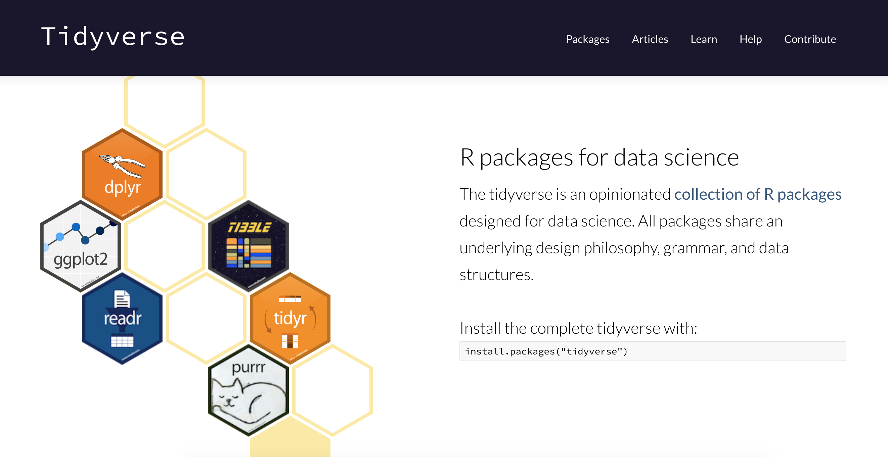

---
jupyter:
  jupytext:
    formats: ipynb,Rmd
    text_representation:
      extension: .Rmd
      format_name: rmarkdown
      format_version: '1.2'
      jupytext_version: 1.11.5
  kernelspec:
    display_name: R
    language: R
    name: ir
---

<!-- #region slideshow={"slide_type": "slide"} -->
# Lecture 1 -  Introduction to R via the tidyverse 

(or Reading data, single data frame manipulations & tidying data in R)
<!-- #endregion -->

<!-- #region slideshow={"slide_type": "slide"} -->
#### Learning objectives
By the end of this lecture and worksheet 1, students should be able to:
* Choose and use the appropriate `readr::read_*` function and function arguments to load a given rectangular, plain text data set into R
* Use the assignment symbol, `<-`, to assign values to objects in R
* Write a dataframe to a .csv file using `readr::write_csv`
* Use `readr::read_csv` to bring data from standard comma separated value (`.csv`) files into R
* Recall and use the following `dplyr` functions and operators for their intended data wrangling tasks:
    - `select`
    - `filter`
    - `mutate`
    - `arrange`
    - `desc`
    - `slice`
    - `pull`
    - `%in%`
* Use the pipe operator, `|>`, to combine two or more functions
* Define the term "tidy data"
* Discuss the advantages and disadvantages of the tidy data format
* Use `tidyr::pivot_wider` & `tidyr::pivot_longer` in R to make untidy data tidy
<!-- #endregion -->

<!-- #region slideshow={"slide_type": "slide"} tags=[] -->
### First, a bit of history about me

- Ph.D. in Neuroscience (2012)
- Started using R in ~ 2010 because I needed to do "complex" statistics
- Other programming languages I have used:
  - Turing
  - Java
  - Matlab
  - Python (only other language that I still currently use and remember)
<!-- #endregion -->

<!-- #region slideshow={"slide_type": "slide"} -->
Oh, and I like gifs, so you might see some in my lecture notes...


<!-- #endregion -->

<!-- #region slideshow={"slide_type": "slide"} -->
### Now, a bit of history about R
<!-- #endregion -->

<!-- #region slideshow={"slide_type": "fragment"} -->
- An implementation of the S programming language (created at Bell labs in 1976)
<!-- #endregion -->

<!-- #region slideshow={"slide_type": "fragment"} -->
- written in C, Fortran, and R itself
<!-- #endregion -->

<!-- #region slideshow={"slide_type": "fragment"} -->
- R was created by Ross Ihaka and Robert Gentleman (Statisticians from NZ)
<!-- #endregion -->

<!-- #region slideshow={"slide_type": "fragment"} -->
- R is named partly after the authors and partly as a play on the name of S
<!-- #endregion -->

<!-- #region slideshow={"slide_type": "slide"} -->
- First stable beta version in 2000
<!-- #endregion -->

<!-- #region slideshow={"slide_type": "fragment"} -->


*Source: https://blog.revolutionanalytics.com/2016/03/16-years-of-r-history.html*
<!-- #endregion -->

<!-- #region slideshow={"slide_type": "fragment"} -->
R currently has more than 15,000 additional packages (as of September 2018)!
<!-- #endregion -->

<!-- #region slideshow={"slide_type": "slide"} -->
#### So, who's used R before?

Let's take a poll!
<!-- #endregion -->

<!-- #region slideshow={"slide_type": "slide"} -->
## Loading/importing data

Taking our first step in data analysis:


*Source: Grolemund & Wickham, [R for Data Science](https://r4ds.had.co.nz/)*
<!-- #endregion -->

<!-- #region slideshow={"slide_type": "slide"} -->
#### The four most common ways to do this in Data Science

1. **read in a text file with data in a spreadsheet format**
2. read from a database (e.g., SQLite, PostgreSQL)
3. scrape data from the web 
4. use a web API to read data from a website 
<!-- #endregion -->

<!-- #region slideshow={"slide_type": "slide"} -->
#### Reading spreadsheet-like data into R

- We recommend using the `readr` package (part of the tidyverse) functions for plain text files

- We recommed using the `readxl` package (part of the tidyverse but needs to be explicitly loaded in addition to tidyverse) for Microsoft Excel files.
<!-- #endregion -->

<!-- #region slideshow={"slide_type": "slide"} -->
#### Workflow for reading in spreadsheet-like data

**Step 1: LOOK AT THE FILE!** 👀

**Step 2:** Match what you see with an appropriate {readr} or {readxl} package function

**Step 3:** Choose the correct arguments for that file and that functin

**Step 1: LOOK AT THE RESULT TO MAKE SURE IT WORKED!** 👀 
<!-- #endregion -->

<!-- #region slideshow={"slide_type": "slide"} -->
#### The simplest case: a comma separated value file

- The simplest plain text data file you will encounter is a a comma separated value (`.csv`) file. 

- `read_csv`, from the {readr} package, is the function of choice here.

- In its most basic use-case, `read_csv` expects that the data file:
    - has column names (or headers),
    - uses a comma (,) to separate the columns, and
    - does not have row names.
<!-- #endregion -->

<!-- #region slideshow={"slide_type": "slide"} -->
Reading in `data/can_lang.csv` data using `read_csv`:

First, load the {readr} or {tidyverse} library:

> Note: {readr} is part of the {tidyverse} metapackage, so when you load {tidyverse} you get the {readr} package functions, as well as a bunch of other goodies we'll learn about shortly!
<!-- #endregion -->

```{r slideshow={'slide_type': 'slide'}}
library(tidyverse)
```

<!-- #region slideshow={"slide_type": "slide"} -->
Next, use the `read_csv` function to read the data into R from the `can_lang.csv` file:
<!-- #endregion -->

```{r slideshow={'slide_type': 'fragment'}}
can_lang1 <- read_csv("data/can_lang.csv")
head(can_lang1)
```

<!-- #region slideshow={"slide_type": "slide"} -->
#### Skipping rows when reading in data

- Often times information about how data was collected, or other relevant information, is included at the top of the data file. 

- Referred to as "metadata"

Reading in `data/can_lang-meta-data.csv`
<!-- #endregion -->

```{r slideshow={'slide_type': 'fragment'}}
can_lang2 <- read_csv("data/can_lang-meta-data.csv", skip = 2)
head(can_lang2)
```

<!-- #region slideshow={"slide_type": "fragment"} -->
If you need to skip rows at the bottom of a file, use the `n_max` argument. 
<!-- #endregion -->

<!-- #region slideshow={"slide_type": "notes"} -->
Note - you will need to know how many lines are in the file to succesfully use this. You can use some shell/command line tools to do this. 

- `wc -l FILENAME` will tell you how many lines are in the file

- `tail -n 10 FILENAME` will print the last 10 lines of the file
<!-- #endregion -->

<!-- #region slideshow={"slide_type": "slide"} -->
#### `read_delim` as a more flexible method to get data into R

- most flexible `readr` function is `read_delim`
- doesn't assume any delimiter, you have to specify

Reading in `data/can_lang.tsv`
<!-- #endregion -->

```{r slideshow={'slide_type': 'fragment'}}
can_lang3 <- read_delim("data/can_lang.tsv",  
                     delim = "\t", 
                     col_names = FALSE)
head(can_lang3)
```

<!-- #region slideshow={"slide_type": "slide"} -->
> Note: you can see that above we also used another argument: `col_names = FALSE`. This is because this version of the data set had no column names, and if we have such a file and don't specify that, then the first observation will be taken (inocrrectly) to be the column names. Another useful extension of this arguement is using it to assign column names, see the example below:

> ```
> can_lang3 <- read_delim("data/can_lang.tsv",  
>                      delim = "\t", 
>                      col_names = c("category", "language", "mother_tongue", 
>                                  "most_at_home", "most_at_work", "lang_known"))
> ```
<!-- #endregion -->

<!-- #region slideshow={"slide_type": "slide"} -->
#### Reading tabular data directly from a URL

- We can also use `read_csv` or `read_delim` (and related functions) to read in tabular data directly from a url that contains tabular data

- In this case, we provide the url to the `read_*` function as the path to the file instead of a path to a local file on our computer

Reading in https://github.com/ttimbers/canlang/blob/master/inst/extdata/can_lang.csv
<!-- #endregion -->

```{r slideshow={'slide_type': 'fragment'}}
can_lang4 <- read_csv("https://raw.githubusercontent.com/ttimbers/canlang/master/inst/extdata/can_lang.csv")
head(can_lang4)
```

<!-- #region slideshow={"slide_type": "slide"} -->
#### Reading data from an Microsoft Excel file

- it is very common to encounter, and need to load into R, data stored as a Microsoft Excel spreadsheet (with the filename extension `.xlsx`)

- To be able to do this, a key thing to know is that even though .csv and `.xlsx` files look almost identical when loaded into Excel, the data themselves are stored completely differently.
<!-- #endregion -->

<!-- #region slideshow={"slide_type": "slide"} -->
Read in `data/can_lang.xlsx`:
<!-- #endregion -->

```{r slideshow={'slide_type': 'fragment'}}
library(readxl)
```

```{r slideshow={'slide_type': 'slide'}}
can_lang5 <- read_excel("data/can_lang.xlsx")
head(can_lang5)
```

<!-- #region slideshow={"slide_type": "notes"} -->
Note - if there are multiple sheets, use the `sheet` argument to specify the sheet number or name.
<!-- #endregion -->

<!-- #region slideshow={"slide_type": "slide"} -->
#### Reading a Microsoft Excel file from the web

When trying to read a Microsoft Excel file from the web into R using a URL you cannot just pass the URL to `read_excel`.

First you must download the file, and then read it locally from there:
<!-- #endregion -->

```{r slideshow={'slide_type': 'slide'}}
url <- "https://github.com/ttimbers/canlang/blob/master/inst/extdata/can_lang.xlsx?raw=true"
download.file(url, "temp.xlsx")
can_lang6 <- read_excel("temp.xlsx")
head(can_lang6)
```

<!-- #region slideshow={"slide_type": "slide"} -->
#### Note about loading data

- It's important to do it carefully + check results after!
  - will help reduce bugs and speed up your analyses down the road
- Think of it as tying your shoes before you run; not exciting, but if done wrong it will trip you up later!

<center></center>

<!-- #endregion -->

<!-- #region slideshow={"slide_type": "slide"} -->
#### Writing files from R to a `.csv` file

- Once you have modified or summarized some data, you often want to save that data to a file for use later, or sharing with others.

- One of the most common formats for this is `.csv`

- To write to `.csv` in R we recommend using `readr::write_csv` as it uses sensible choices for a `.csv` file (e.g., includes column, but not row names, does not write quotes around the data, uses a comma as the delimiter, etc)
<!-- #endregion -->

```{r slideshow={'slide_type': 'fragment'}}
write_csv(can_lang6, "data/can_lang7.csv")
```

<!-- #region slideshow={"slide_type": "slide"} -->
### Cleaning up column names

Column names from wild data can be wild! For example, column names with symbols or white space require special syntax (surround the column names with back ticks) to program with them in R. One of the first things you want to do when you read in data can be to clean these up!

If things are not too bad, and there are not too many, `rename` can be a friend. Let's use `rename` to change the column names that have white space to using underscores. Let's look at the `can_lang-colnames.csv` file for example:
<!-- #endregion -->

```{r slideshow={'slide_type': 'slide'}}
can_lang8 <- read_csv("data/can_lang-colnames.csv")
head(can_lang8)
```

```{r slideshow={'slide_type': 'slide'}}
can_lang9 <- rename(can_lang8, Mother_tongue = `Mother tongue`,
                   Spoken_most_at_home = `Spoken most at home`,
                   Spoken_most_at_work = `Spoken most at work`,
                   Language_known = `Language known`)
head(can_lang9)
```

<!-- #region slideshow={"slide_type": "slide"} -->
#### Cleaning up a lot of column names

Sometimes there are A LOT of column names with non-syntactic names. `rename` is not the best choice here. Instead we'll use the `clean_names` from the {janitor} package to transform all column names to syntactic ones.
<!-- #endregion -->

```{r slideshow={'slide_type': 'fragment'}}
library(janitor)
```

```{r slideshow={'slide_type': 'slide'}}
census <- read_csv("data/census_snippet.csv")
head(census, 3)
```

```{r slideshow={'slide_type': 'slide'}}
clean_census <- clean_names(census)
head(clean_census, 3)
```

<!-- #region slideshow={"slide_type": "fragment"} -->
`clean_names` is a thing of great beauty!!!
<!-- #endregion -->

<!-- #region slideshow={"slide_type": "slide"} -->
## Single data frame manipulations

Here we are going to learn how to use some of the most essential single data frame manipulation functions from the {dplyr} tidyverse package. To explore these, we will work with some of the data from the [Gapminder project](https://www.gapminder.org/). Jenny Bryan (MDS Founder and Software Developer at RStudio) released this as an R package called {[gapminder](https://github.com/jennybc/gapminder)}. We can load the data by loading the {gapminder} library:
<!-- #endregion -->

```{r slideshow={'slide_type': 'fragment'}}
library(gapminder)
```

<!-- #region slideshow={"slide_type": "slide"} -->
Let's take a quick look at the first 6 rows using `head`:
<!-- #endregion -->

```{r slideshow={'slide_type': 'fragment'}}
head(gapminder)
```

<!-- #region slideshow={"slide_type": "slide"} -->
### Use `select` to subset columns

`select` from the [dplyr] package is used to subset the data on variables or columns. Here’s a conventional call to select two columns, `year` and `lifeExp`:
<!-- #endregion -->

```{r slideshow={'slide_type': 'fragment'}}
select(gapminder, year, lifeExp)
```

<!-- #region slideshow={"slide_type": "slide"} -->
Wow! That's a lot of rows... For teaching purposes I am intentionally not binding a name to the output of these commands, as they are for demonstration only, however, that means we don't have an object to call `head` on... In Jupyter we can use this `options` function call to limit the number of rows output when we call an entire data frame.
<!-- #endregion -->

```{r slideshow={'slide_type': 'skip'}}
# run this command to limit data frame output to 10 rows
options(repr.matrix.max.rows = 10)
```

```{r slideshow={'slide_type': 'slide'}}
select(gapminder, year, lifeExp)
```

<!-- #region slideshow={"slide_type": "slide"} -->
You can also use `select` to get a range of columns using names:
<!-- #endregion -->

```{r slideshow={'slide_type': 'fragment'}}
select(gapminder, country:lifeExp)
```

<!-- #region slideshow={"slide_type": "slide"} -->
### Use `filter` to subset rows that meet a specific condition

`filter` from the {dplyr package, takes logical expressions and returns the rows for which all are `TRUE`, for example we can subset rows which have a life expectancy > 29:
<!-- #endregion -->

```{r slideshow={'slide_type': 'fragment'}}
filter(gapminder, lifeExp < 29)
```

<!-- #region slideshow={"slide_type": "slide"} -->
We can susbet rows that meet two conditions, for example we can subset rows which are from the country Rwanda and whose year is > 1979. Note we use the comma `,` to separate the two conditions:
<!-- #endregion -->

```{r slideshow={'slide_type': 'fragment'}}
filter(gapminder, country == "Rwanda", year > 1979)
```

<!-- #region slideshow={"slide_type": "slide"} -->
to filter for multiple conditions that **need not** co-occur, use `|`:
<!-- #endregion -->

```{r slideshow={'slide_type': 'fragment'}}
filter(gapminder, lifeExp > 80 | year == 2007)
```

<!-- #region slideshow={"slide_type": "slide"} -->
Finally, we can use the `%in%` operator to subset rows which have values that match a value from several possible values:
<!-- #endregion -->

```{r slideshow={'slide_type': 'fragment'}}
filter(gapminder, country %in% c("Mexico", "United States", "Canada"))
```

<!-- #region tags=[] -->
### Combining functions with the pipe `|>` operator

In R, we often have to call multiple functions in a sequence to process a data frame. The basic ways of doing this can become quickly unreadable if there are many steps. For example, suppose we need to perform three operations on a data frame `data`:

1. add a new column `new_col` that is double another `old_col`
2. filter for rows where another column, `other_col`, is more than 5, and
3. select only the new column `new_col` for those rows.
<!-- #endregion -->

One way of doing is to just write multiple lines of code, storing temporary objects as you go:

```
output_1 <- mutate(data, new_col = old_col * 2)
output_2 <- filter(output_1, other_col > 5)
output <- select(output_2, new_col)
```


This is difficult to understand for multiple reasons. The reader may be tricked into thinking the named `output_1` and `output_2` objects are important for some reason, while they are just temporary intermediate computations. Further, the reader has to look through and find where `output_1` and `output_2` are used in each subsequent line.


Another option for doing this would be to compose the functions:

```
output <- select(filter(mutate(data, new_col = old_col * 2), other_col > 5), new_col)
```


Code like this can also be difficult to understand. Functions compose (reading from left to right) in the opposite order in which they are computed by R (above, `mutate` happens first, then `filter`, then `select`). It is also just a really long line of code to read in one go.


<!-- #region -->
The pipe operator `|>` solves this problem, resulting in cleaner and easier-to-follow code. |> in built into R so you don’t need to load any packages to use it. The code below accomplishes the same thing as the previous two code blocks:


```
output <- data |>
mutate(new_col = old_col * 2) |>
filter(other_col > 5) |>
select(new_col)
```
<!-- #endregion -->

<!-- #region slideshow={"slide_type": "slide"} -->


The pipe operator takes the thing on the left-hand-side and pipes it into the function call on the right-hand-side – literally, drops it in as the first argument. 

- this year (2021) R created `|>` as a built-in pipe operator!!!
- it was inspired from the pipe from the `magrittr` package `%>%`; which is imported by the `tidyverse` (and `dplyr`) package


*Referring to the [1948 painting La Trahison des images](https://www.wikiart.org/en/rene-magritte/the-treachery-of-images-this-is-not-a-pipe-1948) by Rene Magritte*
<!-- #endregion -->

So now we also have:


Logo by [@LuisDVerde](https://twitter.com/LuisDVerde)

*Source: https://twitter.com/LuisDVerde/status/1430905603405144065*

<!-- #region slideshow={"slide_type": "notes"} -->
Which to use? Most of the time there will be no difference. I will be adopting `|>` in my notes, homeworks, etc however, some videos from past times will use `%>%` and you will still see `|>` in other people's code.

I am choosing `|>` because I can then use piping in R packages without depending upon the `magrittr` package.
<!-- #endregion -->

<!-- #region slideshow={"slide_type": "slide"} -->
So instead of using intermediate objects to combine two functions (*e.g.*, `select` & `filter`) like this:
<!-- #endregion -->

```{r slideshow={'slide_type': 'fragment'}}
gap_under_29 <- filter(gapminder, lifeExp < 29)
select(gap_under_29, country, year)
```

<!-- #region slideshow={"slide_type": "slide"} -->
And instead of composing functions in a hard to read manner:
<!-- #endregion -->

```{r slideshow={'slide_type': 'fragment'}}
select(filter(gapminder, lifeExp < 29), country, year)
```

<!-- #region slideshow={"slide_type": "slide"} -->
We can use the pipe `|>` to create easy to read piplines to connect our function calls:
<!-- #endregion -->

```{r slideshow={'slide_type': 'fragment'}}
filter(gapminder, lifeExp < 29) |>
    select(country, year)
```

<!-- #region slideshow={"slide_type": "slide"} -->
We can even start out our pipelines with an R data frame!
<!-- #endregion -->

```{r slideshow={'slide_type': 'fragment'}}
gapminder |>
    filter(lifeExp < 29) |>
    select(country, year)
```

<!-- #region slideshow={"slide_type": "fragment"} -->
We will embrace the pipe going forward in MDS!
<!-- #endregion -->

<!-- #region slideshow={"slide_type": "slide"} -->
#### Pro-tip for creating objects using the pipe

Don't start writing your code by assigning to an object - it's hard to debug and find the errors:
<!-- #endregion -->

<!-- #region slideshow={"slide_type": "fragment"} -->
```
new_df <- gapminder |> 
    filter(country == "Cabodia") |>
    select(Year, lifeExp) 
```

```
Error in .f(.x[[i]], ...): object 'Year' not found
Traceback:

1. gapminder |> filter(country == "Cabodia") |> select(Year, lifeExp)
2. withVisible(eval(quote(`_fseq`(`_lhs`)), env, env))
3. eval(quote(`_fseq`(`_lhs`)), env, env)
4. eval(quote(`_fseq`(`_lhs`)), env, env)
5. `_fseq`(`_lhs`)
6. freduce(value, `_function_list`)
7. withVisible(function_list[[k]](value))
8. function_list[[k]](value)
9. select(., Year, lifeExp)
10. select.data.frame(., Year, lifeExp)
11. tidyselect::vars_select(tbl_vars(.data), !!!enquos(...))
12. vars_select_eval(.vars, quos)
13. map_if(quos, !is_helper, eval_tidy, mask)
14. map(.x[sel], .f, ...)
15. .f(.x[[i]], ...)
```
<!-- #endregion -->

<!-- #region slideshow={"slide_type": "slide"} -->
Instead, create your pipeline, just dumping it to the screen:
<!-- #endregion -->

```{r slideshow={'slide_type': 'fragment'}}
gapminder |> 
    filter(country == "Cambodia") |>
    select(year, lifeExp)
```

<!-- #region slideshow={"slide_type": "slide"} -->
Then, once you know it works, assign it to an object:
<!-- #endregion -->

```{r slideshow={'slide_type': 'fragment'}}
new_df <- gapminder |>
    filter(country == "Cambodia") |>
    select(year, lifeExp) 
```

<!-- #region slideshow={"slide_type": "slide"} -->
### Use `mutate` to add new variables

Imagine we wanted to recover each country’s GDP. After all, the Gapminder data has a variable for population and GDP per capita. Let’s multiply them together.

`mutate` is a function that defines and inserts new variables into a tibble. You can refer to existing variables by name.
<!-- #endregion -->

```{r slideshow={'slide_type': 'fragment'}}
gapminder |> 
    mutate(tot_gdp = pop * gdpPercap)
```

<!-- #region slideshow={"slide_type": "slide"} -->
To `mutate` more than one column, use commas to separate the mutation for each column:
<!-- #endregion -->

```{r slideshow={'slide_type': 'fragment'}}
gapminder |>
    mutate(tot_gdp = pop * gdpPercap,
          pop_thousands = pop / 1000)
```

<!-- #region slideshow={"slide_type": "slide"} -->
We can even change a column in place:
<!-- #endregion -->

```{r slideshow={'slide_type': 'fragment'}}
gapminder |>
    mutate(lifeExp = round(lifeExp, 0))
```

<!-- #region slideshow={"slide_type": "slide"} -->
### Use `arrange` to sort a data frame

Imagine we wanted to know the country (and year) with the shortest life expectancy? How can we do this?

`arrange` is a function that sorts data frames based on a column, or columns. Let's use it below to answer the questiom we just posed above!
<!-- #endregion -->

```{r slideshow={'slide_type': 'fragment'}}
gapminder |>
    arrange(lifeExp)
```

<!-- #region slideshow={"slide_type": "slide"} -->
What about the hightest life expectancy? We can pair the `arrange` function, with another function, called `desc` to sort the data frame in descending order:
<!-- #endregion -->

```{r slideshow={'slide_type': 'fragment'}}
gapminder |>
    arrange(desc(lifeExp))
```

<!-- #region slideshow={"slide_type": "slide"} -->
### Getting a single value from a data frame

What if you want the name of the country with the longest life expectancy back as just a single character vector, and not a data frame? How do we do this?

We need two additional {dplyr} functions to get this job done using the tidyverse, `slice` and `pull`. `slice` allows you to numerically index rows in R, returning the row number(s) specified. `pull` removes the data frame structure, returning the data as the next simpler data structure in R, a vector. 

Let's use `slice` and `pull` to now extract the name of the country with the longest life expectancy:
<!-- #endregion -->

```{r slideshow={'slide_type': 'fragment'}}
gapminder |> 
    arrange(desc(lifeExp)) |>
    slice(1) |>
    pull(lifeExp)
```

<!-- #region slideshow={"slide_type": "slide"} -->
We just learned A LOT of new functions and operators:

- `select`
- `filter`
- `mutate`
- `arrange`
- `desc`
- `slice`
- `pull`
- ` |>`
- `%in%`

Trust that with practice (and you will get a lot of practice by completing the worksheet and lab homeworks) you will learn these. Also, when needed, you can refer to the data transformation cheat sheet: https://github.com/rstudio/cheatsheets/raw/master/data-transformation.pdf
<!-- #endregion -->

<!-- #region slideshow={"slide_type": "slide"} -->
## Tidy data
<!-- #endregion -->

<!-- #region slideshow={"slide_type": "slide"} -->
#### Shameless borrowing of slides from Jenny Bryan

https://www.slideshare.net/Plotly/plotcon-nyc-behind-every-great-plot-theres-a-great-deal-of-wrangling
<!-- #endregion -->

<!-- #region slideshow={"slide_type": "slide"} -->

<!-- #endregion -->

<!-- #region slideshow={"slide_type": "slide"} -->

<!-- #endregion -->

<!-- #region slideshow={"slide_type": "slide"} -->

<!-- #endregion -->

<!-- #region slideshow={"slide_type": "slide"} -->
#### How should you wrangle your data? 
<!-- #endregion -->

<!-- #region slideshow={"slide_type": "fragment"} -->
#### We make it "tidy"!
<!-- #endregion -->

<!-- #region slideshow={"slide_type": "slide"} -->
### What is tidy data?

A tidy data is one that is satified by these three criteria:

- each row is a single observation,
- each variable is a single column, and
- each value is a single cell (i.e., its row, column position in the data frame is not shared with another value)


What is a variable and an observation may depend on your immediate goal.

*Source: [R for Data Science](https://r4ds.had.co.nz/) by Garrett Grolemund & Hadley Wickham*
<!-- #endregion -->

<!-- #region slideshow={"slide_type": "slide"} -->
### A tale of 4 data tables...

...here is the same data represented in 4 different ways, let's vote on which are tidy


<!-- #endregion -->

<!-- #region slideshow={"slide_type": "notes"} -->
*Example source: https://garrettgman.github.io/tidying/*
<!-- #endregion -->

<!-- #region slideshow={"slide_type": "slide"} -->
Statistical question: What variables are associated with the number of TB cases?

This data is tidy, true or false?

| country | year  | cases_per_capita |
|---------|-------|---|
| Afghanistan | 1999|      745/19987071
|Afghanistan |2000    | 2666/20595360
|      Brazil |1999|   37737/172006362
|      Brazil |2000  | 80488/174504898
|      China |1999| 212258/1272915272
|      China |2000 |213766/1280428583
<!-- #endregion -->

<!-- #region slideshow={"slide_type": "slide"} -->
Statistical question: What variables are associated with the number of TB cases?

This data is tidy, true or false?


| country | cases (year=1999) | cases (year=2000)|
|---------|-------|-------|
| Afghanistan |   745 |  2666
|  Brazil | 37737 | 80488
|  China | 212258 | 213766

| country | population (year=1999) | population (year=2000)|
|---------|-------|-------|
| Afghanistan |  19987071 |  20595360 |
| Brazil | 172006362 | 174504898 |
| China | 1272915272 | 1280428583 |
<!-- #endregion -->

<!-- #region slideshow={"slide_type": "slide"} -->
Statistical question: What variables are associated with the number of TB cases?

This data is tidy, true or false?

| country | year  | cases | population |
|---------|-------|-------|------------|
| Afghanistan | 1999  |  745  | 19987071|
| Afghanistan | 2000 |  2666 |  20595360|
|Brazil |1999 | 37737  |172006362|
| Brazil| 2000 | 80488 | 174504898|
| China | 1999 | 212258 |1272915272|
|  China |2000 | 213766 | 1280428583|
<!-- #endregion -->

<!-- #region slideshow={"slide_type": "slide"} -->
Statistical question: What variables are associated with the number of TB cases?

This data is tidy, true or false?

| country | year  | key | value |
|---------|-------|-------|------------|
|Afghanistan |1999 |     cases   |     745
| Afghanistan |1999| population  | 19987071
|  Afghanistan |2000|      cases |      2666
|  Afghanistan| 2000| population |  20595360
|       Brazil| 1999|      cases |     37737
|       Brazil |1999| population | 172006362
|       Brazil| 2000|      cases  |    80488
|       Brazil |2000| population | 174504898
|        China |1999|      cases  |   212258
|       China |1999| population |1272915272
|       China |2000|      cases |    213766
|       China |2000| population| 1280428583
<!-- #endregion -->

<!-- #region slideshow={"slide_type": "slide"} -->
### Pivoting longer

`pivot_longer` from the {tidyr} package takes a wide data frame and making it longer! {tidyr} is another package in the {tidyverse} metapackage.
<!-- #endregion -->

<!-- #region slideshow={"slide_type": "fragment"} -->


*Source: April Hill's [teachthat](https://github.com/apreshill/teachthat/) GitHub repository*
<!-- #endregion -->

<!-- #region slideshow={"slide_type": "slide"} -->
Consider the data frame below and that we are interested in finding what variables are associated with the number of TB cases?
<!-- #endregion -->

```{r slideshow={'slide_type': 'fragment'}}
table4a
```

<!-- #region slideshow={"slide_type": "fragment"} -->
This is currently difficult as the values for the variable year are stuck in column names. We can use the `pivot_longer` function to tidy this data:
<!-- #endregion -->

```{r slideshow={'slide_type': 'slide'}}
table4a |>
    pivot_longer(`1999`:`2000`, names_to = "year", values_to = "cases")
```

```{r slideshow={'slide_type': 'slide'}}
# or a less verbose and efficient way to specify this:
table4a |>
    pivot_longer(-country, names_to = "year", values_to = "cases")
```

<!-- #region slideshow={"slide_type": "notes"} -->
To use `pivot_longer` we need to specify:

1. the dataset

2. The columns we want to apply our pivot operation to (we use `select`-like syntax for this, and if you want to operate on all columns in a data frame, you can provide the function `everything()` here.

2. the name of a new column that will be created, whose values will come from the names of the columns that we want to combine (the result argument)

3. the name of a new column that will be created, whose values will come from the values of the columns we want to combine (the value argument)

4. the names of the columns that we want to combine (we list these after specifying the key and value, and separate the column names with commas)
<!-- #endregion -->

<!-- #region slideshow={"slide_type": "slide"} -->
### Pivoting wider

`pivot_wider` from the {tidyr} package takes a narrow data frame and making it wider! It is the opposite of `pivot_longer`!
<!-- #endregion -->

<!-- #region slideshow={"slide_type": "slide"} -->
Consider the data frame below and that we are interested in finding what variables are associated with the number of TB cases?
<!-- #endregion -->

```{r slideshow={'slide_type': 'fragment'}}
table2
```

<!-- #region slideshow={"slide_type": "fragment"} -->
This is currently difficult as observation is scattered across multiple rows. We can tidy this data frame with the function `pivot_wider`.
<!-- #endregion -->

```{r slideshow={'slide_type': 'slide'}}
table2 |>
    pivot_wider(names_from = type, values_from = count)
```

<!-- #region slideshow={"slide_type": "notes"} -->
To use `pivot_wider` we need to specify:

1. the dataset

2. the name of the column whose values we would like to use as column names when we widen the data

3. the name of the column whose values you would like to spread into separate columns based on the value they had in the column specified as the key
<!-- #endregion -->

<!-- #region slideshow={"slide_type": "slide"} -->


https://www.tidyverse.org/
<!-- #endregion -->

<!-- #region slideshow={"slide_type": "slide"} -->
### The tidy tools manifesto

"*The goal of these principles is to provide a uniform interface so that tidyverse packages work together naturally, and once you’ve mastered one, you have a head start on mastering the others.*"

https://cran.r-project.org/web/packages/tidyverse/vignettes/manifesto.html


<!-- #endregion -->

<!-- #region slideshow={"slide_type": "slide"} -->
### The tidy tools manifesto

There are four basic principles to a tidy API:

1. Reuse existing data structures.

2. Compose simple functions with the pipe (`|>`).

3. Embrace functional programming.

4. Design for humans.
<!-- #endregion -->

<!-- #region slideshow={"slide_type": "notes"} -->
### Reuse existing data structures.

- Where possible, re-use existing data structures, rather than creating custom data structures for your own package
- When it is not possible to use an existing data structure, use S3 class (simplest OO system in R) built on top of an atomic vector or list
- When working on data.frames/tibbles, assume the data is tidy
<!-- #endregion -->

<!-- #region slideshow={"slide_type": "notes"} -->
### Compose simple functions with the pipe (|>)

- A powerful strategy for solving complex problems is to combine many simple pieces. Each piece should be easily understood in isolation, and have a standard way to combine with other pieces.  

- In R, this strategy plays out by composing single functions with the pipe, `|>`.

- The pipe is a common composition tool that works across all packages.
<!-- #endregion -->

<!-- #region slideshow={"slide_type": "notes"} -->
### Embrace functional programming

R is a functional programming language; embrace it, don’t fight it. If you’re familiar with an object-oriented language like Python or C#, this is going to take some adjustment. But in the long run you will be much better off working with the language rather than fighting it.

Generally, this means you should favour:

- Immutable objects and copy-on-modify semantics. This makes your code easier to reason about.
- The generic functions provided by S3 and S4. These work very naturally inside a pipe. If you do need mutable state, try to make it an internal implementation detail, rather than exposing it to the user.
- Tools that abstract over for-loops, like the `apply` family of functions or the map functions in `purrr`.
<!-- #endregion -->

<!-- #region slideshow={"slide_type": "notes"} -->
### Design for humans

Design your API primarily so that it is easy to use by humans. Computer efficiency is a secondary concern because the bottleneck in most data analysis is thinking time, not computing time.

- Invest time in naming your functions. Evocative function names make your API easier to use and remember.

- Favour explicit, lengthy names, over short, implicit, names. Save the shortest names for the most important operations.

- Think about how autocomplete can also make an API that’s easy to write. Make sure that function families are identified by a common prefix, not a common suffix. This makes autocomplete more helpful, as you can jog your memory with the prompts. For smaller packages, this may mean that every function has a common prefix (e.g. stringr, xml2, rvest).
<!-- #endregion -->

<!-- #region slideshow={"slide_type": "slide"} -->
## What did we learn today?

- How to read and write data using R

- Single table functions from {dplyr} to manipulate data frames

- A new operator, the pipe `|>` for combining function calls

- What tidy data is, and how to use the {tidyr} functions to get our data tidy

- *That R is awesome for manipulating data!*
<!-- #endregion -->

<!-- #region slideshow={"slide_type": "slide"} -->
## Attributions
- These notes were prepared by Dr. Tiffany Timbers as part of DSCI 523 at UBC-Vancouver
- MUCH of these notes were derived from [Stat 545](https://stat545.com/) created by Jenny Bryan
- [R for Data Science](https://r4ds.had.co.nz/index.html) by Garrett Grolemund & Hadley Wickham
<!-- #endregion -->
